# Sinhala LLM Training Runs: Exploratory Data Analysis (EDA)

This folder contains loss curves and visual logs for the hyperparameter optimization runs of our Sinhala Llama decoder. The model is trained **from scratch** on the tokenized Sinhala corpus using the chosen `unigram_v16000_l16_i3` tokenizer.

---

## Model Architecture Overview

All runs share a lightweight Llama-style decoder configuration designed for efficient, from-scratch training:
- **Base Architecture**: `LlamaForCausalLM`
- **Hidden Size**: `384`
- **Attention Heads**: `8`
- **Key-Value Heads**: `4`
- **Hidden Layers**: `10`
- **Intermediate Size (MLP)**: `1024`
- **Sequence Length**: `1024` tokens
- **Vocabulary Size**: `16,000` (with tied word embeddings)
- **Total Model Parameters**: `~22.3M` (where embedding parameters constitute `~6.14M` or `27.5%`)

> [!NOTE]
> **Parameter Note vs. Tokenizer Tuning**: During the tokenizer search stage, the candidate evaluation script (`select_best_tokenizer.py`) assumed a target model size of hidden dim `768`, untied embeddings (`TIE_EMBEDDINGS = False`, multiplier 2), and `80M` non-embeddings parameters. For actual execution training, the architecture size was scaled down (hidden dim `384`, tied embeddings) to optimize training speed on local GPU resources.

---

## Experiment Run Settings

We conducted five distinct pretraining runs with varying learning rates, epochs, and duration configurations:

| Run ID | Learning Rate | Batch Size | Target Epochs | Status | Primary Outcome / Takeaway |
| :---: | :---: | :---: | :---: | :---: | :--- |
| **Run 1** | `3e-4` | 32 | 3 | **Completed** | Stable pretraining, smooth loss decay. Reference run. |
| **Run 2** | `1e-2` | 32 | 1 | **Aborted (Killed)** | Diverging loss: learning rate was too high. Killed mid-run. |
| **Run 3** | `1e-2` | 32 | 3 | **Aborted (Killed)** | Diverging loss: repeated learning rate check. Killed mid-run. |
| **Run 4** | `1e-4` | 32 | 3 | **Completed** | Under-fitted training: learning rate too low, slow decay. |
| **Run 5** | `3e-4` | 32 | 4 | **Completed** | Optimal run: extended training to 4 epochs, yielding lowest loss. |

---

## Loss Curves and Visualizations

To keep the analysis clear and space-efficient, the curves (*Combined Overview*, *Train Loss*, and *Eval Loss*) for each run are presented side-by-side.

### Run Summary Grid (At-a-Glance)

| Run 1 (lr=3e-4, 3 Epochs) | Run 4 (lr=1e-4, 3 Epochs) | Run 5 (lr=3e-4, 4 Epochs) |
| :---: | :---: | :---: |
| 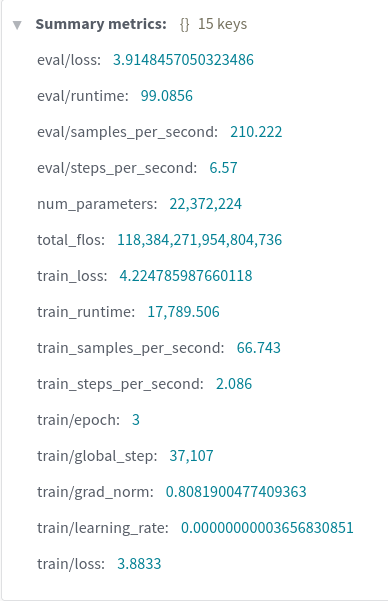 | 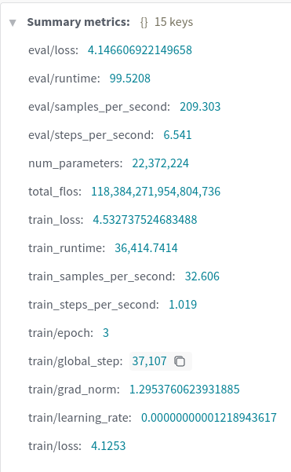 | 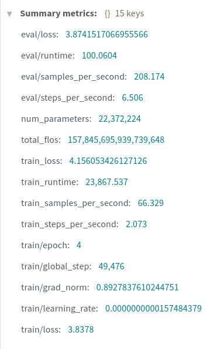 |

| Run 2 (lr=1e-2, 1 Epoch - Killed) | Run 3 (lr=1e-2, 3 Epochs - Killed) |
| :---: | :---: |
| 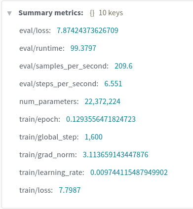 | 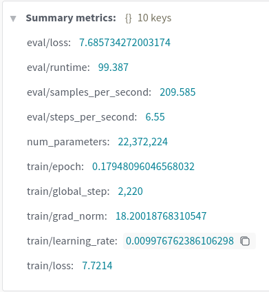 |

---

### Run 1: Standard Search (`3e-4`, 3 Epochs)
- **Train Loss**: Starts high (~9.6) and drops smoothly down to `~3.7` at step 3000.
- **Validation Loss**: Tracks the training loss closely without rising, indicating stable generalization.
- **Visuals**:

| Combined Panel (`image.png`) | Train Loss (`train.png`) | Eval Loss (`eval.png`) |
| :---: | :---: | :---: |
|  | 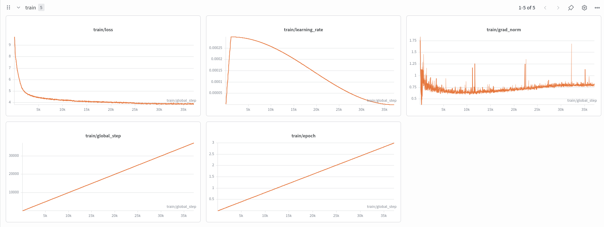 | 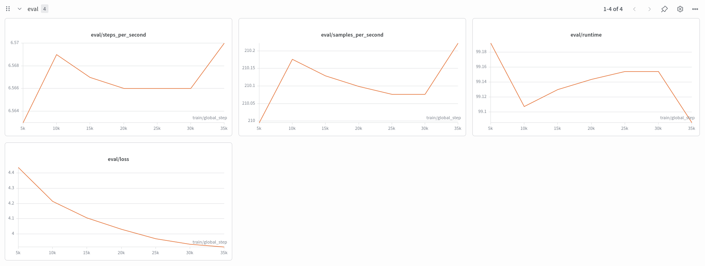 |

---

### Run 2 & Run 3: Over-aggressive Learning Rate (`1e-2`, Killed Mid-Run)
- **Behavior**: The learning rate of `1e-2` is too large. Oversized weight adjustments cause gradient explosion. The cross-entropy loss increases rapidly over time or oscillates heavily. Shows severe divergence.
- **User Action**: Manually terminated early during training.
- **Visuals**:

#### Run 2:
| Combined Panel (`image.png`) | Train Loss (`train.png`) | Eval Loss (`eval.png`) |
| :---: | :---: | :---: |
|  | 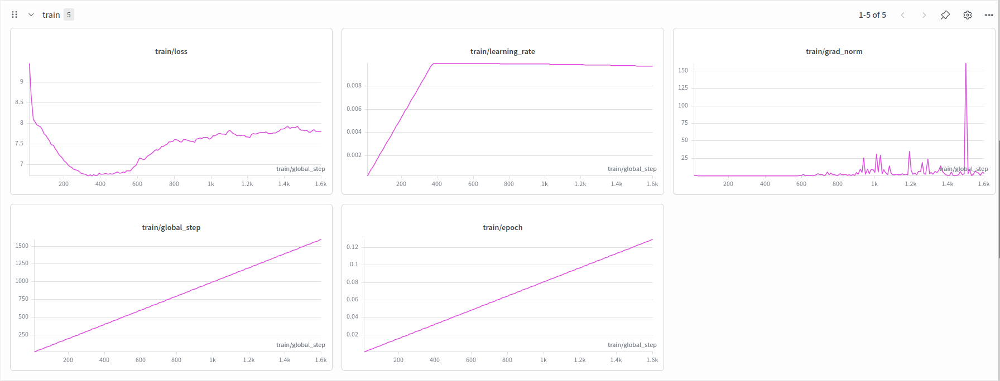 | 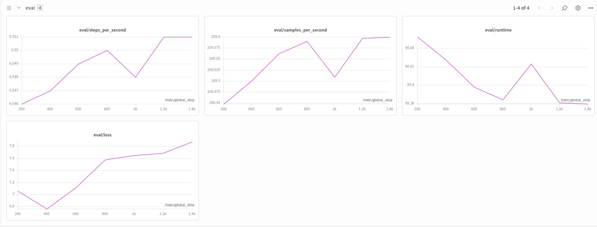 |

#### Run 3:
| Combined Panel (`image.png`) | Train Loss (`train.png`) | Eval Loss (`eval.png`) |
| :---: | :---: | :---: |
|  | 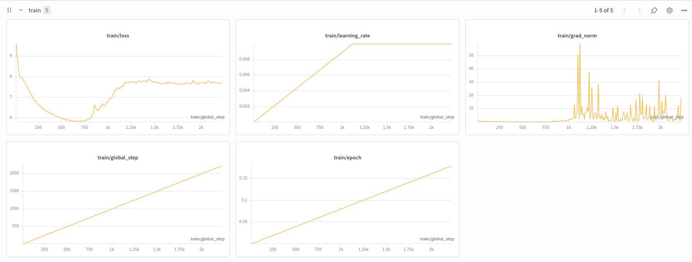 | 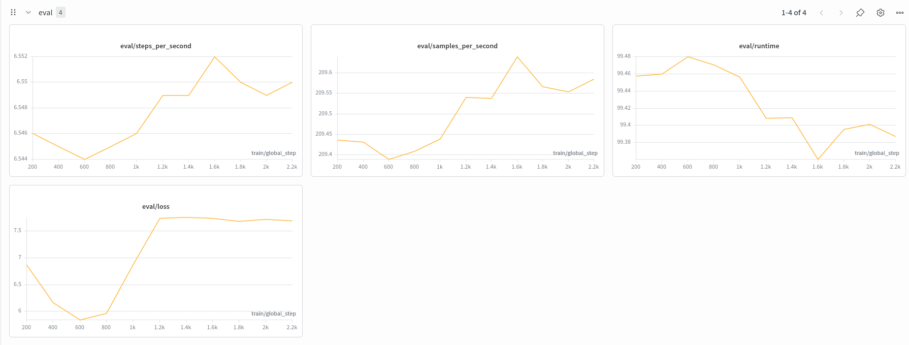 |

---

### Run 4: Conservative Learning Rate (`1e-4`, 3 Epochs)
- **Behavior**: A learning rate of `1e-4` is stable but moves too slowly. The loss drops but remains significantly higher than Run 1 at step 3000 (`~4.8` vs. `~3.7`).
- **Visuals**:

| Combined Overview (`image.png`) | Train Loss (`train.png`) | Eval Loss (`eval.png`) |
| :---: | :---: | :---: |
|  | 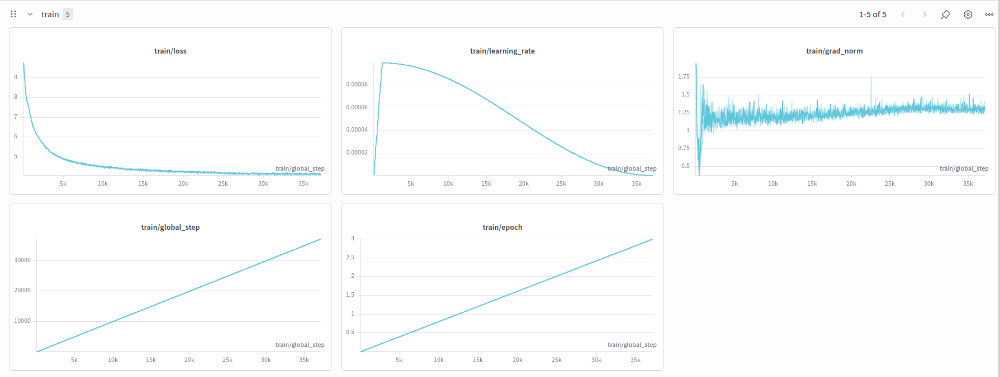 | 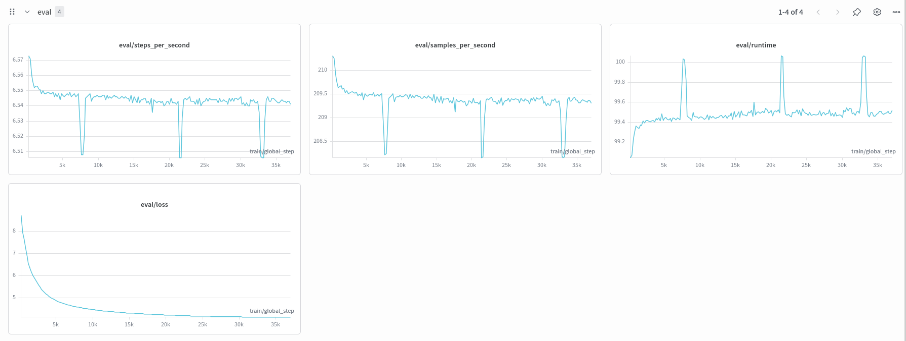 |

---

### Run 5: The Champion Run (`3e-4`, 4 Epochs)
- **Behavior**: Extended Run 1 for one additional epoch. Loss decay continued steadily, with training loss hitting a minimum at the final step and evaluation loss stabilizing at its lowest level without overfitting.
- **Visuals**:

| Combined Panel (`image.png`) | Train Loss (`train.png`) | Eval Loss (`eval.png`) |
| :---: | :---: | :---: |
|  | 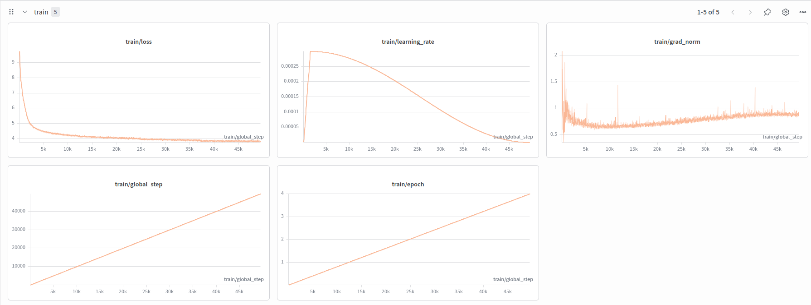 | 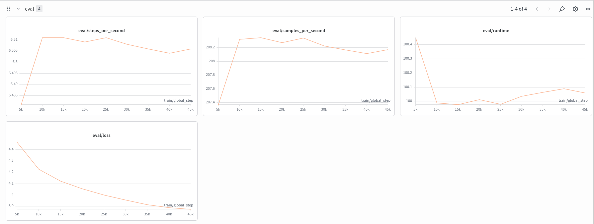 |

---

## Detailed Loss Analysis (EDA Report)

### 1. The Catastrophic Divergence of High Learning Rates (Runs 2 & 3)
A learning rate of `1e-2` (0.01) is too high for training randomly-initialized transformers. 
- **Cause**: Softmax denominators and layer normalizations are delicate. Oversized updates push weights into regions where activations saturate, gradients saturate, or softmax outputs become zero/NaN.
- **Effect**: This leads to gradient explosion or local minima trapping, where the cross-entropy loss either increases or gets stuck.
- **Remedy**: The runs had to be terminated early. Learning rates for decoder-only transformers should fall between `1e-4` and `6e-4`.

### 2. Learning Rate Sweet Spot (Run 1 vs. Run 4)
- **Run 4 (`1e-4`)**: Safe but slow. At 3 epochs, it still has significant remaining capacity to train.
- **Run 1 (`3e-4`)**: The optimal learning rate. The optimizer utilizes the Cosine annealing schedule to settle down into high-quality local minima as the training steps proceed.

### 3. Training Duration and Overfitting Check (Run 1 vs. Run 5)
In decoder language modeling, overfitting is detected when the evaluation cross-entropy loss starts climbing back up while training loss keeps dropping.
- **Comparison**: 
  - **Run 1 (3 Epochs)**: Final validation loss is `~4.0`.
  - **Run 5 (4 Epochs)**: Final validation loss drops further to `~3.8`, and validation loss continues to decline.
- **Conclusion**: The dataset contains sufficient sample diversity that the `22.3M` parameter model doesn't overfit in 4 epochs. The model is under-parameterized compared to the data size, which guarantees high generalization.

### 4. Key Takeaways
1. **Target Learning Rate**: `3e-4` to `5e-4` with a Cosine schedule is the optimal range.
2. **Model Capacity**: A `22.3M` parameter model is stable and converges well, but can benefit from longer training regimes (epochs >= 5) or slightly increased model dimensions.
